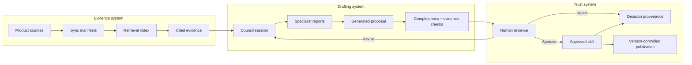
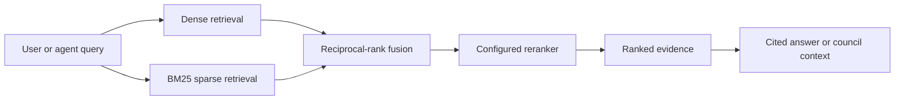
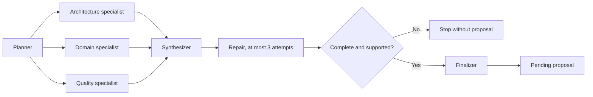

Anvay is easier to operate when five concepts are clear: product, source, evidence, proposal, and approved skill.

## The three-system model

## Product

A product is the root isolation boundary. It usually represents one service, application, or tightly related set of repositories that should share engineering context.

Every source, chunk, retrieval query, council session, proposal, and skill carries a product ID. Business-unit or team fields are display metadata; they do not create a wider search boundary.

This rule prevents accidental context leakage and keeps answers relevant to the system being changed.

## Source

A source is a configured input that belongs to one product. Sources provide stable resource identifiers and content for synchronization.

Product onboarding starts with GitHub. Additional connectors are managed from Sources after onboarding. Credentials remain scoped to the source and are encrypted at rest.

### Delta-safe synchronization

Anvay does not blindly re-index every file. It records a manifest of successfully indexed resources and classifies the next sync:

| State | Meaning | Action |
|---|---|---|
| Added | Resource has no prior manifest row | Read, chunk, index, then record |
| Updated | Content or embedding configuration changed | Write replacement index data before retiring stale chunks |
| Unchanged | Hash and relevant configuration match | Skip expensive processing |
| Removed | Resource no longer exists | Delete derived chunks, then remove the manifest row |

The ordering matters. A failed replacement does not destroy the last known-good indexed version.

### Source identity

Resources need canonical identifiers that survive temporary working directories. A file cloned from GitHub should be identified by repository and path, not by the local temporary directory used during synchronization. Stable identity enables meaningful diffs, citations, and cleanup.

### Source of truth versus derived state

SQLite manifests record what completed successfully. Qdrant and repository maps are derived serving state. If a derived index is lost, Anvay can rebuild it from the configured sources and manifests; it must not infer sync truth from whatever happens to remain in the vector database.

## Evidence

Evidence is source material returned by retrieval. Anvay combines semantic and lexical retrieval, fuses candidates, and reranks them before presenting context to an answer or council agent.

Evidence should preserve:

- the product boundary
- a stable source URI
- the relevant text or code span
- enough metadata to inspect where the claim came from

The retrieval index is derived state. It improves access to evidence but does not replace the source repository or synchronization manifest.

### Retrieval stages

Dense retrieval captures semantic similarity. Sparse retrieval preserves exact names and technical terms. Rank fusion combines both candidate sets without pretending their scores share one scale. The reranker then compares the query with candidate passages more directly.

Good retrieval output is not merely relevant-looking text. It must be scoped to the product, point back to stable sources, and include enough context for a person to verify the claim.

## Repo map

The repo map is a compact symbol outline built from source structure. It helps the council understand where important modules and symbols live without placing an entire repository into a model prompt.

It complements retrieval: the repo map provides structural orientation, while retrieved chunks provide detailed evidence.

## Council session

A council session is a bounded generation workflow:

The planner defines the evidence needs and outline. Specialists examine architecture, domain behavior, and quality concerns. The synthesizer writes the draft. Repair can fill identified gaps within a fixed attempt limit. Evaluation checks structure and evidence constraints before finalization.

A session may fail without producing a proposal. That is expected when the output is incomplete or unsupported.

### Why the council is bounded

Unbounded agent conversations are difficult to reason about, expensive to operate, and prone to hiding failure behind additional prose. Anvay uses named stages, fixed specialist roles, deterministic evaluation where possible, and a repair cap. A clean failure is preferable to quietly publishing an incomplete skill.

## Proposal

A proposal is generated, reviewable content. It is not yet trusted product memory.

The Review screen is the governance boundary. Reviewers can inspect citations, edit the draft, reject it, or request revision. Revision count is intentionally bounded so the system does not hide an endless autonomous loop.

## Approved skill

Approval turns a proposal into a durable skill artifact in the configured skills repository. The artifact includes product guidance and provenance that an MCP client can load when working on relevant tasks.

Approved skills remain ordinary files under version control. This makes changes auditable, portable, and reversible.

### Provenance

Provenance connects the approved artifact to its source proposal, council session, citations, reviewer, and revision count. This lets maintainers answer not only “what guidance is active?” but also “why was it accepted, and from which evidence?”

## Permissions

Anvay separates organization role from product membership. Product owners and editors can manage sources and run council sessions; viewers can inspect product information without receiving write capabilities. Organization administrators manage broader access.

The backend is authoritative. Hiding a button in the UI is not an authorization boundary.

## A useful mental model

Think of Anvay as three connected systems:

1. **Evidence system:** sources, manifests, chunks, retrieval, and citations.
2. **Drafting system:** council sessions, bounded repair, and proposals.
3. **Trust system:** human review, approved skills, provenance, and MCP delivery.

Keeping these systems distinct is what lets Anvay be useful without pretending generated content is automatically correct.
