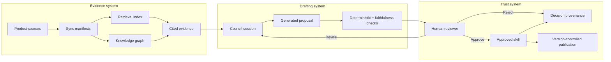
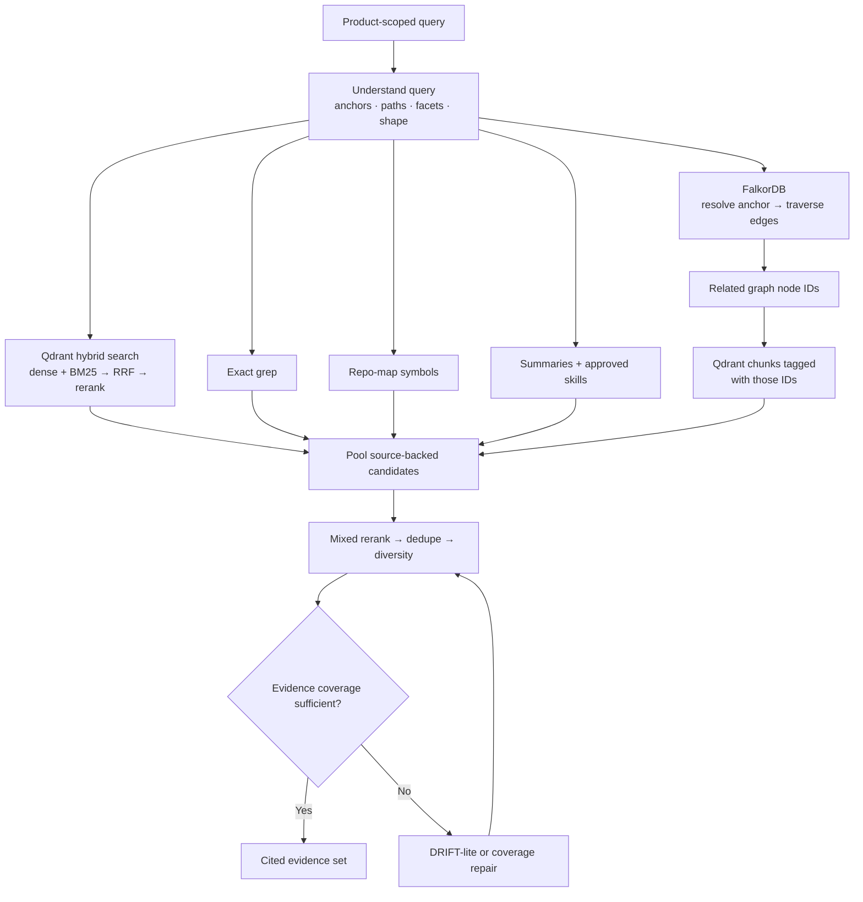
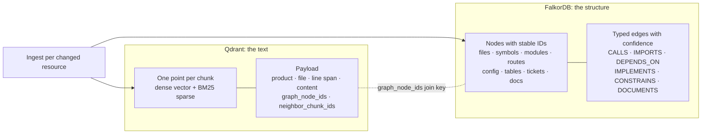
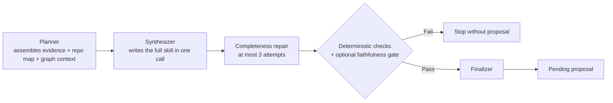

Anvay is easier to operate when six concepts are clear: product, source, evidence, the knowledge graph, proposal, and approved skill.

## The three-system model

## Product

A product is the root isolation boundary. It usually represents one service, application, or tightly related set of repositories that should share engineering context.

Every source, chunk, retrieval query, graph node, council session, proposal, and skill carries a product ID. Business-unit or team fields are display metadata; they do not create a wider search boundary.

This rule prevents accidental context leakage and keeps answers relevant to the system being changed.

## Source

A source is a configured input that belongs to one product. Sources provide stable resource identifiers and content for synchronization.

Anvay ingests five kinds of source:

| Source | What it contributes |
|---|---|
| GitHub repository | Code, structure, symbols, and doc-comments. Required at product onboarding. |
| Local filesystem | Any directory on a machine Anvay can reach. Disabled by default in production (`ANVAY_ENABLE_LOCAL_FS_SOURCES`). |
| Jira | Decisions, constraints, and history behind the work that never made it into code. |
| Confluence | Architecture docs, runbooks, and long-form knowledge. |
| Remote MCP server | Any Streamable-HTTP MCP source, so the evidence base can grow with your toolchain. |

Product onboarding starts with GitHub. The other connector types are added from a product's Sources screen afterward. Credentials remain scoped to the source and are encrypted at rest.

### Continuous synchronization

A source can be marked `watch: true`. The `anvay daemon --product <id>` process subscribes to every watched connector for that product and re-runs ingest as update events arrive, instead of waiting for a manually triggered sync. It bootstraps with a full sync unless started with `--no-bootstrap`.

The daemon is a separate long-running process; it is not started automatically by the API or by the documented production Compose stack. Run it yourself (as a supervised process, systemd unit, or container) for any source that needs to stay current without manual resync.

### Delta-safe synchronization

Anvay does not blindly re-index every file. It records a manifest of successfully indexed resources and classifies the next sync:

| State | Meaning | Action |
|---|---|---|
| Added | Resource has no prior manifest row | Read, chunk, index, then record |
| Updated | Content or embedding configuration changed | Write replacement index data before retiring stale chunks |
| Unchanged | Hash and relevant configuration match | Skip expensive processing |
| Removed | Resource no longer exists | Delete derived chunks, then remove the manifest row |

The ordering matters. A failed replacement does not destroy the last known-good indexed version.

### Source identity

Resources need canonical identifiers that survive temporary working directories. A file cloned from GitHub is identified by repository and path, not by the local temporary directory used during synchronization. Stable identity enables meaningful diffs, citations, and cleanup.

### Source of truth versus derived state

SQLite manifests record what completed successfully. Qdrant (vectors) and FalkorDB (the product graph) are derived serving state, alongside the repo map JSON. If a derived index is lost, Anvay can rebuild it from the configured sources and manifests; it must not infer sync truth from whatever happens to remain in the vector database or graph.

## Evidence

Evidence is source material returned by retrieval. Anvay combines semantic and lexical retrieval, fuses candidates, and reranks them before presenting context to an answer or council agent.

Evidence should preserve:

- the product boundary
- a stable source URI
- the relevant text or code span
- enough metadata to inspect where the claim came from

The retrieval index is derived state. It improves access to evidence but does not replace the source repository or synchronization manifest.

### Retrieval stages

The FalkorDB branch of the diagram is the join between the two stores; [how vector and graph storage fit together](#how-vector-and-graph-storage-fit-together) below explains exactly what each store holds and how the join works.

Dense retrieval captures semantic similarity. Sparse retrieval preserves exact names and technical terms. Rank fusion combines both candidate sets without pretending their scores share one scale. The reranker then compares the query with candidate passages more directly. This dense + BM25 → RRF → rerank path is the low-level retrieval pipeline (`retrieval/pipeline.py::retrieve`).

The product-facing evidence layer (`retrieval/evidence.py::retrieve_evidence`) fans out further: hybrid search, exact `grep`, the repo map, graph-local traversal, graph community summaries, and approved skills, mixed with reranking, channel quotas, file diversity, and a coverage gate. When initial coverage is thin, it runs a bounded, deterministic follow-up pass over the same channels rather than issuing another LLM query. There is no HyDE and no query-rewriting model in this path.

Good retrieval output is not merely relevant-looking text. It must be scoped to the product, point back to stable sources, and include enough context for a person to verify the claim.

## Repo map

The repo map is a compact symbol outline built from source structure with tree-sitter. It is built at sync time, ranked against the current query or council topic, and token-budgeted before use, so the council can orient itself without placing an entire repository into a model prompt.

It complements retrieval: the repo map provides structural orientation, while retrieved chunks provide detailed evidence.

## Knowledge graph

Alongside chunks and the repo map, ingestion extracts a product-scoped knowledge graph into FalkorDB. Tree-sitter extraction supplies structural edges directly; a bounded, strictly-validated LLM fact layer adds relationships tree-sitter can't see on its own: `CALLS`, `IMPLEMENTS`, `DEPENDS_ON`, `CONSTRAINS`, and similar edge types. Ingestion also writes community summaries: higher-level descriptions of clusters of related nodes, used to give retrieval and the council broad context without traversing the whole graph.

The graph is a **navigation** layer, not an answer source on its own. It seeds and biases retrieval (resolving an entity, walking local edges, pulling in community summaries), and every graph-informed answer still resolves back to cited corpus evidence. `ask_product_graph` is the MCP tool built on this: it resolves entities mentioned in a question, traverses the local graph, retrieves the cited evidence behind what it finds, and returns a change-impact or dependency answer grounded in that evidence.

FalkorDB is derived state, exactly like Qdrant: it can be rebuilt from source content and the extraction pipeline. It is not part of the documented production Docker Compose stack by default; see [Deployment](/docs/deployment) before relying on graph features outside local development.

## How vector and graph storage fit together

Anvay keeps text and structure in two separate stores and joins them in application code. Qdrant holds every chunk of source text with its embeddings. FalkorDB holds the product graph: entities and their relationships. Neither store queries the other. The join key is the set of stable graph node IDs written into each chunk's payload during ingest.

### What Qdrant holds

Every synced file is chunked along code structure (tree-sitter function and class boundaries) or document structure (heading hierarchy). Each chunk becomes one Qdrant point carrying a dense embedding for semantic similarity and a BM25 sparse vector for exact terms, split across a code collection and a text collection. Every retrieval path filters on product ID.

### What FalkorDB holds

Each product gets its own named graph. A deterministic extraction pass always runs first and produces the reliable backbone: file, symbol, module, API route, configuration, and database nodes, plus Jira tickets and document headings from non-code sources, connected by structural edges such as `CONTAINS`, `DECLARES`, `IMPORTS`, and `CALLS`. The bounded LLM fact layer then adds only allowlisted relationship types (`CALLS`, `IMPLEMENTS`, `DEPENDS_ON`, `CONSTRAINS`, `DOCUMENTS`, `MENTIONS`, `PART_OF_FLOW`), each with a confidence score and source line anchors. Facts outside the allowlist are dropped, not trusted.

Node IDs are deterministic and derived from the entity itself (kind, product, path, name), so the same entity keeps the same ID across re-syncs. That stability is what makes the IDs usable as a join key.

### How the join happens

At ingest time, every chunk's payload records two things:

- `graph_node_ids`: the graph nodes whose source lines overlap the chunk.
- `neighbor_chunk_ids`: the chunk IDs of the chunk's depth-one graph neighbors within the same resource, precomputed and ranked by edge confidence.

At query time, the graph channel resolves entities mentioned in the query to graph nodes, traverses their relationships in FalkorDB (bounded depth, edge types chosen from the query shape), and sends the resulting node IDs back to Qdrant to fetch the chunks tagged with them. For one-hop questions the precomputed `neighbor_chunk_ids` answer the hop directly from Qdrant payloads, skipping the FalkorDB round trip. That fast path is a cache of one traversal shape; FalkorDB remains the canonical graph.

The design principle: the graph navigates, the corpus answers. Graph traversal explains why two pieces of evidence are related and steers retrieval toward structurally relevant code, but every claim in the final evidence set cites a real source chunk with a file and line span.

## Council session

A council session is a bounded generation workflow. The current pipeline is a single synthesis call, not a multi-specialist fanout:

The planner assembles a deterministic context pack: retrieved evidence, the ranked repo map, and graph/community context, gathered once at ingest and session start rather than re-fetched per stage. The synthesizer writes the entire product skill, all required sections, from that pack in a single LLM call. If sections are missing, a targeted repair loop fills the gaps, capped at three attempts. Evaluation then runs five deterministic checks (identity, section structure, name match, citation-anchor faithfulness, and trigger phrasing) plus an optional, fail-soft LLM entailment gate (`config.council.faithfulness_gate`) that rejects claims the cited excerpt doesn't actually support.

An earlier version of Anvay fanned this out across separate architecture, domain, and quality specialist agents before synthesis. That fanout was removed: the single-call synthesizer with deterministic evaluation produced comparable quality for meaningfully less cost and latency. It would only be reintroduced with an eval-set result showing it's worth it.

A session may fail without producing a proposal. That is expected when the output is incomplete or unsupported.

### Why the council is bounded

Unbounded agent conversations are difficult to reason about, expensive to operate, and prone to hiding failure behind additional prose. Anvay uses named stages, a fixed repair cap, and deterministic evaluation where possible. A clean failure is preferable to quietly publishing an incomplete skill.

## Proposal

A proposal is generated, reviewable content. It is not yet trusted product memory.

The Review screen is the governance boundary. Reviewers can inspect citations, edit the draft, reject it, or request revision. Revision count is intentionally bounded so the system does not hide an endless autonomous loop.

## Approved skill

A council session produces exactly one product-scoped skill, named after the product (for example `payments-api-skill`). Approval turns that proposal into a durable Markdown artifact in the configured skills repository.

The skill has thirteen required sections (including a system map, data model, interfaces and contracts, invariants and constraints, security and secrets, and known traps) plus optional sections such as testing strategy. One section, **How To Use The Knowledge Base**, is never LLM-authored: it's a static, deterministic template that tells an agent which MCP tool to reach for by question shape. That keeps the routing guidance from drifting and costs no generation tokens.

Approved skills remain ordinary files under version control. This makes changes auditable, portable, and reversible. Older approved deployments may still have multiple skill files per product from a prior generation model; those remain readable, but new council sessions produce a single skill.

### Provenance

Provenance connects the approved artifact to its source proposal, council session, citations, reviewer, and revision count. This lets maintainers answer not only "what guidance is active?" but also "why was it accepted, and from which evidence?"

## Permissions

Anvay separates the org-wide user role (`admin`, `editor`, `viewer`) from per-product membership, which can grant a different role on a specific product. Editors can manage sources and run council sessions on the products they have access to; viewers can inspect product information without write capabilities. Admins manage broader access, including pending access requests.

The backend is authoritative. Hiding a button in the UI is not an authorization boundary.

## A useful mental model

Think of Anvay as three connected systems:

1. **Evidence system:** sources, manifests, chunks, the knowledge graph, retrieval, and citations.
2. **Drafting system:** council sessions, bounded repair, and proposals.
3. **Trust system:** human review, approved skills, provenance, and MCP delivery.

Keeping these systems distinct is what lets Anvay be useful without pretending generated content is automatically correct.
