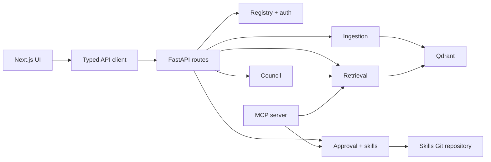
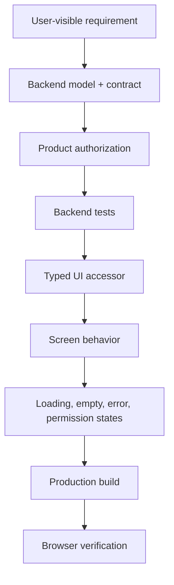

Anvay has a Python backend and a Next.js frontend. Most changes cross a clear API boundary: the backend defines product-scoped behavior and typed contracts; the UI exposes that behavior without inventing parallel business logic.

## Development architecture



## Before you edit

Read the repository instructions first:

1. `anvay/AGENTS.md` for backend invariants and validation commands.
2. `anvay-ui/AGENTS.md` and `anvay-ui/DESIGN.md` before changing screens, routes, or visual components.
3. `anvay/ENGINEERING.md` when changing data models, retrieval, council behavior, or API contracts.

Two rules dominate code review:

- **Product is the root entity.** Every resource and query remains product-scoped.
- **Humans approve, agents draft.** No generated proposal becomes an approved skill without explicit user action.

## Repository map

| Area | Location | Use it for |
|---|---|---|
| API routes | `anvay/api/routes/` | HTTP contracts, authorization, product workflows |
| Ingestion | `anvay/ingest/` | chunking, manifests, embeddings, derived-index updates |
| Retrieval | `anvay/retrieval/` | dense and lexical retrieval, fusion, reranking |
| Council | `anvay/council/` | graph execution, specialist prompts, proposal queue |
| Skills | `anvay/skills/` | models, approval, storage, Git publication |
| MCP server | `anvay/mcp_server/` | tools exposed to coding clients |
| UI screens | `anvay-ui/components/screens/` | one screen component per route |
| UI API client | `anvay-ui/lib/api/index.ts` | typed endpoint access |
| UI domain types | `anvay-ui/lib/types.ts` | shared frontend contracts |

## Local development

Start backend dependencies and the API:

```bash
cd anvay
uv sync
cp anvay.yaml.example anvay.yaml
cp .env.example .env
make services-up
uv run uvicorn anvay.api.app:app --port 8000 --reload
```

Start the UI in a second terminal:

```bash
cd anvay-ui
npm install
npm run dev
```

Open `http://localhost:3000`. Public landing and docs routes can render independently; authenticated product routes require the backend.

## Follow an end-to-end change

When adding or changing a user-visible capability, trace it in this order:

1. Define or update the backend model.
2. Add the product-scoped route and authorization check.
3. Add focused backend tests.
4. Add one typed function in `anvay-ui/lib/api/index.ts`.
5. Reuse types from `anvay-ui/lib/types.ts`.
6. Update the existing screen or add one screen component under `components/screens/`.
7. Verify empty, loading, success, permission, and error states.

Do not add a UI-only field that the backend cannot serve. Do not call backend routes directly from components when the API client already owns that boundary.



## Test your change

Backend:

```bash
uv run ruff check anvay tests
uv run pytest -q
```

Frontend:

```bash
npm run build
npm run dev
```

Run retrieval evaluation after changing chunking, embeddings, sparse encoding, fusion, reranking, repo maps, or evidence assembly:

```bash
uv run pytest -m eval
```

### Match validation to risk

| Change | Minimum validation |
|---|---|
| Text or narrow visual adjustment | frontend build and affected viewport |
| API response or permission | route tests, frontend build, denied and allowed cases |
| Ingestion behavior | unit tests, sync integration test, delta behavior |
| Retrieval behavior | unit tests, retrieval eval, latency comparison |
| Council behavior | graph tests, completeness checks, proposal-gate verification |
| Approval path | tests proving Git write precedes approved status |

## Common contribution paths

### Add an API endpoint

Keep request and response data in Pydantic models, apply product authorization, and add a test for the public route. The frontend accessor should remain thin: one function per endpoint, no business decisions.

### Add a connector

A connector is incomplete until it can enumerate stable resources, read content, participate in manifest diffing, report progress, and preserve product scope. UI exposure comes after backend synchronization works.

### Change council behavior

Preserve the bounded graph and proposal gate. Add deterministic checks where possible, keep evidence attached to material claims, and ensure incomplete output cannot reach review.

### Tune retrieval

Treat eval results as part of the implementation. Record the baseline, change one meaningful variable, and compare recall, ranking quality, faithfulness, and latency before adopting the change.

### Change documentation

Public docs live in the separate `anvay-docs` repository and are fetched from Tina Cloud. Write task-oriented MDX there, validate the curated files, commit and push `main`, then wait for Tina indexing before verifying `/docs`.

Use fenced `mermaid` blocks for architecture or lifecycle diagrams. Keep node labels short, avoid diagrams wider than the article, and pair every diagram with prose that explains why the flow matters.

## Debugging approach

Follow the first incorrect boundary rather than patching the final symptom:

1. Reproduce with one product and one request.
2. Inspect the browser network or API response.
3. Confirm the typed frontend contract.
4. Read the route and authorization path.
5. Trace the domain service and durable-state write.
6. Inspect derived indexes only after source-of-truth state is understood.

For asynchronous workflows, use session events and source progress logs to locate the stage that failed.

## Pull request checklist

- The change stays inside one product boundary.
- Generated content still requires human approval.
- Public routes and types have tests.
- Backend lint and tests pass.
- Frontend production build passes.
- Screens follow the locked information architecture and design tokens.
- No unrelated refactor or generated artifact is included.
