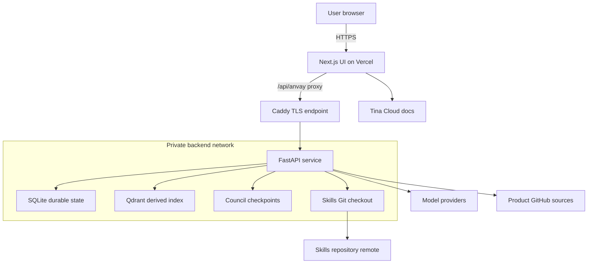
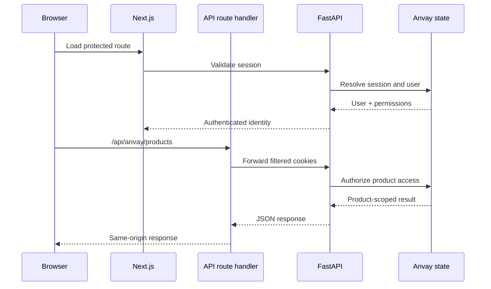
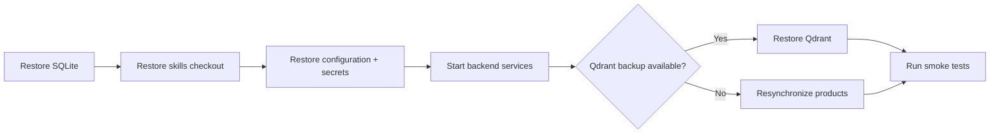

This guide describes the supported production shape: the FastAPI backend and private data services run on a controlled host, while the Next.js UI can run on Vercel and proxy browser requests to the API.

## Target architecture



| Component | Recommended location | Exposure |
|---|---|---|
| Next.js UI | Vercel | Public HTTPS |
| FastAPI backend | Docker host behind Caddy | Public HTTPS API |
| Qdrant | Docker network | Private only |
| SQLite state | Persistent backend volume | Private only |
| Skills checkout | Persistent backend volume | Private; pushed to Git |

Browser API calls use the UI's same-origin `/api/anvay/*` route. The route handler forwards only the Anvay session and CSRF cookies to the configured backend.

### Request path



## 1. Prepare the backend host

Install Docker and the Compose plugin. Expose ports `80` and `443`; do not expose Qdrant directly to the internet.

```bash
git clone <backend-repository-url> anvay
cd anvay
cp anvay.prod.yaml.example anvay.yaml
cp .env.example .env
```

## 2. Configure secrets

Set the production environment:

```bash
ANVAY_ENV=production
ANVAY_TOKEN_KEY=...
ANVAY_SECRET_KEY=...
ANVAY_ADMIN_API_KEY=...
ANVAY_BOOTSTRAP_ADMIN_EMAIL=admin@example.com
ANVAY_BOOTSTRAP_ADMIN_PASSWORD=...
ANVAY_ALLOWED_ORIGINS=https://app.example.com
ANVAY_API_DOMAIN=api.example.com
ANVAY_SKILLS_REPO=https://github.com/example/anvay-skills.git
ANVAY_SKILLS_REPO_TOKEN=...
```

Add the model-provider variables required by `anvay.yaml`.

Generate the connector encryption key:

```bash
uv run python -c "from anvay.auth.token_cipher import TokenCipher; print(TokenCipher.generate_key())"
```

Generate independent random values for the application secret, admin API key, and bootstrap password:

```bash
python -c "import secrets; print(secrets.token_urlsafe(48))"
```

Do not reuse one generated value for multiple settings.

### Secret responsibilities

| Setting | Protects |
|---|---|
| `ANVAY_TOKEN_KEY` | encryption of connector credentials at rest |
| `ANVAY_SECRET_KEY` | application security material |
| `ANVAY_ADMIN_API_KEY` | privileged bearer access for controlled automation |
| bootstrap password | initial administrator login |
| skills repository token | clone, commit, and push of approved skills |
| provider API keys | embeddings, reranking, and council model access |

Store production secrets in the host or deployment platform secret manager. Do not bake them into container images.

## 3. Start the backend

```bash
docker compose -f docker-compose.prod.yml up -d --build
docker compose -f docker-compose.prod.yml ps
```

Verify the public health endpoint:

```bash
curl -i https://api.example.com/health
```

Expected body:

```json
{"status":"ok"}
```

Verify that Qdrant is not publicly reachable. Its ports should remain inside the Docker network.

Inspect service health:

```bash
docker compose -f docker-compose.prod.yml ps
docker compose -f docker-compose.prod.yml logs --tail=100 api
```

Resolve startup errors before deploying the UI. A public frontend cannot compensate for a partially initialized backend.

## 4. Deploy the UI

Create a Vercel project from `anvay-ui` and set:

```bash
ANVAY_API_URL=https://api.example.com
NEXT_PUBLIC_TINA_CLIENT_ID=...
TINA_TOKEN=...
TINA_BRANCH=main
```

`TINA_TOKEN` is server-side and must use an appropriate read-only content token. Do not expose it through a `NEXT_PUBLIC_` variable.

Add the final Vercel domain to `ANVAY_ALLOWED_ORIGINS` on the backend, then redeploy or restart the API after changing the environment.

The docs route fetches published content from Tina Cloud server-side. It does not read a local docs checkout at runtime. Use a read-only Tina content token and verify the configured branch matches the branch Tina indexes.

## 5. Bootstrap access

Open the UI root and sign in with the bootstrap administrator credentials. The root route validates an existing session before showing the authenticated product dashboard; unauthenticated visitors see the public landing page.

After first login:

1. Configure the skills repository from Setup.
2. Create a product.
3. Connect and synchronize a GitHub source.
4. Run a council session.
5. Approve a proposal and verify the Git push.

Rotate or remove bootstrap credentials according to your operating policy.

## 6. Network and authorization boundaries

- terminate public TLS at Caddy or an equivalent reverse proxy
- expose the API only through its intended HTTPS hostname
- keep Qdrant and persistent volumes private
- allow browser origins explicitly
- rely on backend authorization for every protected operation
- keep filesystem sources disabled in environments where arbitrary host paths are unsafe
- scope connector credentials to one product source

UI permission checks improve usability, but FastAPI authorization is the security boundary.

## 7. Protect sensitive state

Back up these persistent locations:

- SQLite registry, authentication, proposal, and session data
- the local skills repository checkout
- Qdrant storage
- council checkpoints
- repository-map artifacts

Qdrant is derived, but restoring it avoids a full re-index. SQLite and the approved skills repository contain durable workflow state and require stricter backup discipline.

### Recovery priority



Test restoration on a schedule. A backup that has never been restored is an assumption, not a recovery plan.

## 8. Observability

Follow API logs:

```bash
docker compose -f docker-compose.prod.yml logs -f api
```

When Langfuse is configured, keep prompt and response content tracing disabled unless your organization has explicitly approved sending that content:

```bash
ANVAY_TRACE_CONTENT=false
```

Monitor:

- API error rate and latency
- source-sync failures
- model-provider failures and rate limits
- Qdrant availability
- council completion and repair failures
- skill Git push failures
- authentication and access-request events

Correlate source-sync and council failures with model-provider status. External model errors can look like application regressions if provider health and rate limits are not visible.

## 9. Upgrade safely

```bash
git pull
docker compose -f docker-compose.prod.yml up -d --build
```

Before upgrading, read migration notes and back up persistent volumes. After upgrading, run the smoke checks below before inviting users back.

Prefer a staged rollout:

1. snapshot durable state
2. build new images
3. run backend health checks
4. verify login and one read-only product request
5. run one source sync
6. verify one council proposal without approving it
7. approve a controlled proposal and confirm Git publication

## Production smoke test

- `/health` returns `200`.
- The landing page and public docs render without an authenticated session.
- A valid session reaches the Products dashboard.
- An invalid session cannot access protected backend routes.
- Product viewers cannot manage sources or run council.
- Source synchronization streams progress and completes.
- Ask returns product-scoped citations.
- Council creates a pending proposal, not an approved skill.
- Approval commits and pushes the skill before marking the proposal approved.
- MCP starts for one product and returns only that product's context.
