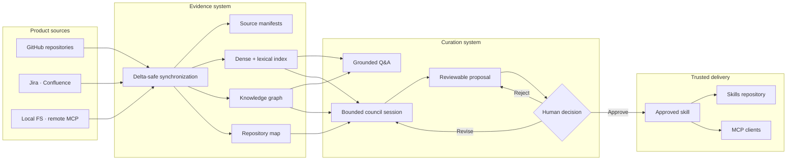

Anvay turns source repositories, tickets, docs, and a product's knowledge graph into context that both people and AI coding agents can use. It indexes evidence, answers product questions with citations, drafts durable guidance, and waits for a human before publishing that guidance as an approved skill.

Use these docs to run Anvay locally, connect your first product, understand the trust model, and expose approved context through MCP.

## Anvay is self-hosted

Anvay is open source (Apache-2.0) and **self-hosted**. There is no managed cloud and no waitlist: you clone the repositories, run them on your own machine or infrastructure, and your product context never leaves it. The public marketing site and these docs are read-only — the **Sign in** and **Request access** links there only work against an instance you (or your team) already run.

To run Anvay you clone three repositories, side by side:

| Repository | Role | Clone |
|---|---|---|
| `anvay-core` | FastAPI backend, retrieval, graph, council, MCP server | `git clone https://github.com/0xaeres/anvay-core.git anvay` |
| `anvay-ui` | Next.js web console (this UI) | `git clone https://github.com/0xaeres/anvay-ui.git` |
| `anvay-docs` | These docs (only needed to edit documentation) | `git clone https://github.com/0xaeres/anvay-docs.git` |

Most users need only `anvay` and `anvay-ui`. The [Quickstart](/docs/quickstart) walks through cloning and running both; [Deployment](/docs/deployment) covers running them in production.

## How Anvay fits together

Anvay keeps evidence collection, generated drafts, and trusted guidance separate. That separation is the core of the product:

The evidence system can update continuously. The trust system changes only through an explicit review action.

## What you can do with Anvay

- Ask where a behavior is implemented and inspect the supporting source evidence.
- Trace the files, symbols, and structural relationships involved in a change with the product knowledge graph.
- Keep product context current through delta-safe source synchronization, optionally continuous via the watch daemon.
- Run a bounded council session that drafts one maintainable product skill per product.
- Review, revise, approve, or reject every draft before it becomes trusted context.
- Serve approved skills and retrieved evidence to MCP-compatible coding clients.

## The workflow

Anvay has one product-scoped loop:

1. **Connect sources.** Add the repositories, tickets, docs, and other connectors that define a product.
2. **Synchronize evidence.** Anvay reads changed resources, chunks them, builds retrieval and graph indexes, and preserves stable source references.
3. **Ask grounded questions.** Developers query the indexed product and receive cited answers rather than untraceable summaries.
4. **Draft guidance.** The council retrieves evidence and produces one proposal for the product's skill.
5. **Review explicitly.** A human edits, approves, rejects, or requests another revision.
6. **Serve through MCP.** Approved skills and product evidence become available to coding agents.

> Agents draft. Humans approve. A council run never publishes trusted guidance by itself.

## Choose your next step

| Goal | Read |
|---|---|
| Run Anvay and connect a repository | [Quickstart](/docs/quickstart) |
| Understand products, sources, retrieval, the graph, and review | [Core concepts](/docs/concepts) |
| Connect Claude, Codex, Cursor, or another client | [MCP integration](/docs/mcp) |
| Script sync, query, council, and eval from a terminal | [CLI reference](/docs/cli) |
| Operate Anvay in production | [Deployment](/docs/deployment) |
| Change Anvay itself | [Contributing](/docs/contributing) |

## The trust boundary

A **product** is Anvay's root isolation boundary. Sources, chunks, graph nodes, sessions, proposals, skills, and queries all belong to one product. Anvay does not create cross-product search or silently reuse guidance between products.

The second boundary is publication. Retrieval may surface live source evidence, and the council may draft a recommendation, but only an explicit approval writes durable skill content. This makes the difference between generated advice and trusted product memory visible.

### Why the boundary matters

Without an explicit boundary, generated summaries quietly become institutional memory. They can outlive the source evidence that produced them, spread across tools, and become difficult to correct. Anvay instead keeps every stage inspectable:

- source content remains the factual origin
- retrieval and the graph return citations to that content
- generated drafts remain proposals
- reviewer actions create provenance
- approved files stay versioned in Git

## What Anvay is not

Anvay is not a general-purpose chat history, an autonomous documentation publisher, or a replacement for source control. It is a context engine built around current evidence, bounded generation, and reviewable artifacts.

It also does not treat a vector database or graph store as the source of truth. Source manifests and approved skill files remain durable state; Qdrant and FalkorDB are derived indexes that can be rebuilt from them.

## System shape

| Layer | Responsibility |
|---|---|
| Sources | GitHub, local filesystem, Jira, Confluence, and remote MCP connectors, plus a watch daemon for continuous sync |
| Registry | Products, source configuration, memberships, and sync manifests |
| Retrieval | Dense and lexical search, rank fusion, reranking, and source citations |
| Graph | Tree-sitter and LLM-derived product knowledge graph, community summaries, change-impact traversal |
| Council | Planner, single-call synthesis, bounded repair, evaluation, and finalization |
| Review | Human approval, rejection, revision, and provenance |
| MCP | Portable access to approved skills and product evidence |

## Who uses each surface

| Persona | Primary surface | Typical task |
|---|---|---|
| Developer | Ask and Sources | Locate implementation evidence and verify current behavior |
| Maintainer or SME | Council and Review | Turn repeated project knowledge into one approved product skill |
| Platform administrator | Setup and access controls | Configure publication, users, and production dependencies |
| Coding agent | MCP | Load the approved skill and retrieve product evidence before editing |

## Documentation conventions

Commands assume the backend repository is named `anvay` and the sibling frontend is named `anvay-ui`. Replace example product IDs, domains, repository URLs, and absolute paths with values from your environment.

When a guide includes a verification step, run it before continuing. Anvay has several external dependencies, and detecting a missing service early is much easier than diagnosing it during source synchronization or a council run.

Ready to see the loop end to end? Continue with the [Quickstart](/docs/quickstart).
