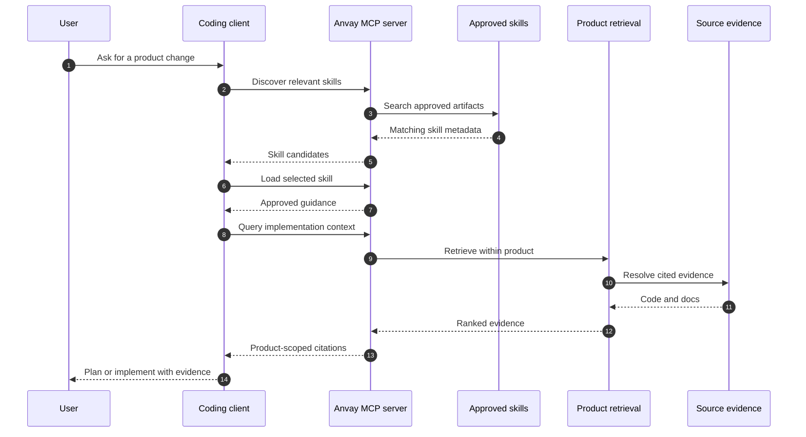

Anvay exposes approved skills and product evidence through a standard input/output MCP server. Each server process is started for one product, preserving the same isolation boundary used by the UI and API.

## How the integration works



The coding client orchestrates tool calls. Anvay supplies two different forms of context:

- **approved skills** for durable conventions, boundaries, and known traps
- **retrieved evidence** for the current implementation and source citations

## Before you connect

Confirm that:

- the backend configuration is available on the machine running the MCP server
- the target product exists
- at least one source has synchronized successfully
- the client can launch local commands
- approved skills exist if you expect skill discovery to return results

## Start the server manually

From the backend repository:

```bash
uv run anvay-mcp-server --product my-product
```

The server communicates over standard input/output. It is normally launched by the coding client rather than left running in a terminal.

The MCP process needs access to the same configuration and data services as other backend commands. If Qdrant or model services are remote, the machine running MCP must be able to reach them.

## Client configuration

Use an absolute path for the repository and configuration file:

```json
{
  "mcpServers": {
    "anvay": {
      "command": "uv",
      "args": [
        "--directory",
        "/absolute/path/to/anvay",
        "run",
        "anvay-mcp-server",
        "--product",
        "my-product"
      ],
      "env": {
        "ANVAY_CONFIG": "/absolute/path/to/anvay/anvay.yaml"
      }
    }
  }
}
```

The exact settings file varies by client, but the command and arguments stay the same.

### One server entry per product

If a client regularly works across several products, configure distinct entries:

```json
{
  "mcpServers": {
    "anvay-payments": {
      "command": "uv",
      "args": [
        "--directory",
        "/absolute/path/to/anvay",
        "run",
        "anvay-mcp-server",
        "--product",
        "payments-api"
      ]
    },
    "anvay-developer-portal": {
      "command": "uv",
      "args": [
        "--directory",
        "/absolute/path/to/anvay",
        "run",
        "anvay-mcp-server",
        "--product",
        "developer-portal"
      ]
    }
  }
}
```

Explicit names make the boundary visible to both the user and the coding agent. Do not create one MCP entry that searches every product.

## Available capabilities

The server exposes tools for:

| Capability | Use it when |
|---|---|
| Skill discovery | Find approved guidance relevant to a task or file context |
| Skill retrieval | Load the full approved skill before planning a change |
| Code-context query | Ask a product-scoped question and retrieve supporting evidence |
| Corpus search | Inspect direct hybrid-search results for a focused query |
| Outcome reporting | Record whether retrieved guidance helped complete the task |

Tool names can evolve with the backend contract. Let the MCP client enumerate the server's current tools instead of hard-coding assumptions in prompts.

### Skills versus direct retrieval

| Need | Use | Reason |
|---|---|---|
| Project conventions | approved skill | reviewed and durable |
| Current implementation | context query | reflects synchronized source evidence |
| Exact identifier or string | corpus or lexical search | preserves precise technical terms |
| Broad task orientation | skill discovery, then context query | combines policy with live code |

## Recommended agent workflow

For a non-trivial code change:

1. Find relevant approved skills.
2. Load the best matching skill.
3. Query product context for the behavior being changed.
4. Inspect cited files before editing.
5. Make and test the change in the repository.
6. Report whether the skill and evidence were useful.

An approved skill gives durable conventions and architecture guidance. Retrieval gives live source evidence. Use both; neither should replace reading the affected code.

### Prompt pattern

Give the client a specific product and outcome:

```text
Use the Anvay MCP server for payments-api.
Load relevant approved guidance, then retrieve cited evidence for how webhook
retries are implemented. Identify the files and tests that would be affected
by changing the retry limit. Do not infer behavior without source evidence.
```

This prompt separates guidance discovery, evidence retrieval, and change-impact analysis.

## Verify the connection

Ask the client to list Anvay tools, then run a narrow query:

```text
Using Anvay for product my-product, find the source that defines request authentication.
```

A successful response should identify the Anvay tool call and return product-scoped evidence. If the client only answers from its existing context, verify that the MCP server actually started.

Verification checklist:

- the client lists the Anvay server as connected
- tool enumeration succeeds
- the configured product ID is correct
- skill discovery returns only approved artifacts
- evidence results include stable source references
- an intentionally unknown question produces uncertainty rather than fabricated files

## Security model

The MCP process inherits access from its local environment. Protect the backend configuration, provider credentials, and product data available to that process. Do not put secrets directly into prompts or commit client configuration containing credentials.

MCP does not weaken Anvay's publication boundary. It can read approved skills and retrieve evidence; it does not approve proposals on behalf of a user.

## Troubleshooting

### The client cannot launch `uv`

Use the absolute path returned by:

```bash
which uv
```

### The product is not found

Check the product ID in the UI URL or backend registry. The MCP argument uses the stable ID, not the display name.

### No skills are returned

Skill discovery only returns approved artifacts. Check Review for pending proposals and approve the intended skill before retrying.

### Retrieval fails

Verify backend configuration, Qdrant connectivity, model-provider credentials, and that the product source completed synchronization.

### Context appears to cross products

Stop and treat it as a tenancy defect. Every MCP server invocation and every retrieval request must remain bound to the configured product.

### The process exits immediately

Run the exact configured command in a terminal. Check Python environment resolution, configuration paths, missing environment variables, and startup logs before debugging the client.

### Results are stale

Check the source's most recent synchronization. MCP reads Anvay's current approved skills and retrieval state; it does not synchronize repositories automatically for each query.
