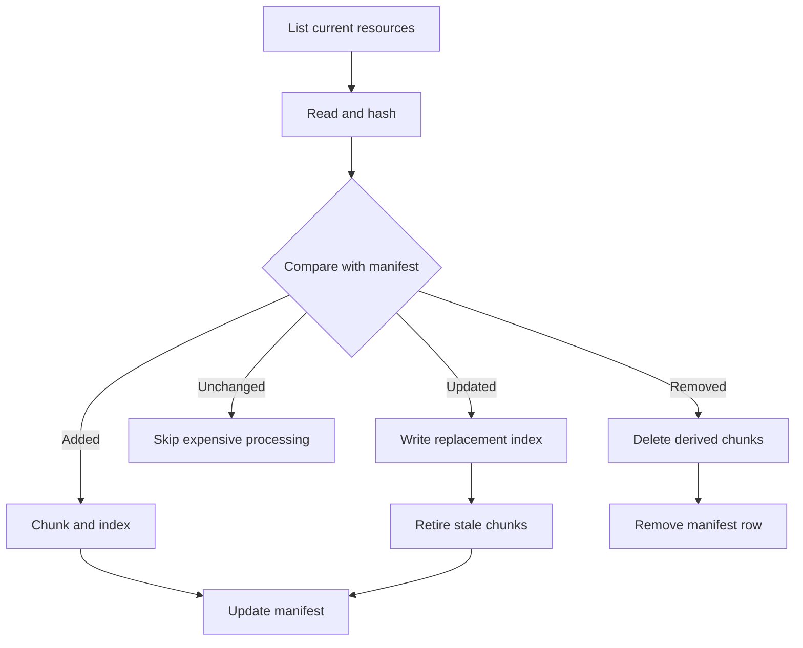

This guide clones both repositories and takes you to a working product in the Anvay UI.

## What you will build

By the end of this guide, one product will have a synchronized GitHub source, grounded query results, a completed council session, and an approved skill available to MCP clients.

```mermaid
flowchart LR
  Clone["Clone repositories"] --> Config["Configure backend"]
  Config --> Services["Start Qdrant + FalkorDB + API"]
  Services --> UI["Start Next.js UI"]
  UI --> Setup["Connect skills repository"]
  Setup --> Product["Create product + GitHub source"]
  Product --> Sync["Synchronize evidence"]
  Sync --> Ask["Verify grounded answer"]
  Ask --> Council["Run council"]
  Council --> Review["Review proposal"]
  Review --> Approve["Approve and publish"]
```



## Prerequisites

You need:

- Python 3.13 or newer
- `uv`
- Node.js and npm
- Docker for Qdrant (vector store) and FalkorDB (product graph)
- a model provider API key — Anvay uses DeepInfra by default (`LLM_API_KEY`); local Jina embedder/reranker are optional (see `anvay.yaml.example`)
- a GitHub personal access token for the product repository

Anvay is self-hosted and open source — you run it yourself.

## 1. Clone the repositories

Clone the two repositories next to each other:

```bash
mkdir -p projects && cd projects
git clone https://github.com/0xaeres/anvay-core.git anvay
git clone https://github.com/0xaeres/anvay-ui.git
```

Recommended local layout:

```text
projects/
├── anvay/       # backend: API, retrieval, council, MCP
└── anvay-ui/    # this web console
```

## 2. Configure the backend

```bash
cd anvay
uv sync
cp anvay.yaml.example anvay.yaml
cp .env.example .env
```

Add the required provider and encryption values to `.env`. Generate the connector-token encryption key with:

```bash
uv run python -c "from anvay.auth.token_cipher import TokenCipher; print(TokenCipher.generate_key())"
```

Keep product repository credentials out of this file. You enter the product-scoped GitHub token during onboarding, and Anvay encrypts it at rest.

Review `anvay.yaml` before starting. Confirm the Qdrant URL, embedding model, reranker model, and chat model point to services your machine can reach. Model dimensions and collection configuration must agree before indexing begins.

## 3. Start services and API

`make services-up` starts the backing stores in Docker — Qdrant on
`http://localhost:6333` and FalkorDB on `localhost:6379` — then you run the API:

```bash
make services-up
uv run uvicorn anvay.api.app:app --port 8000 --reload
```

Models default to DeepInfra. To serve the embedder and reranker locally instead,
run `make local-models-up` and switch to the `jina-local` profile in `anvay.yaml`.

Verify the API:

```bash
curl http://localhost:8000/health
```

Expected response:

```json
{"status":"ok"}
```

Also verify the protected API behavior:

```bash
curl -i http://localhost:8000/me
```

With authentication enabled and no session, this request should return `401`. That confirms the API is reachable and the auth boundary is active.

## 4. Start the UI

In another terminal:

```bash
cd anvay-ui
npm install
npm run dev
```

Open `http://localhost:3000`.

If you have no valid session, the root route sends you to the public landing page. Sign in to enter the product workspace.

Public `/landing` and `/docs` pages do not require the FastAPI backend. Product routes do.

## 5. Configure the skills repository

Open `/setup`. Create or connect the Git repository where approved product skills will be stored.

This repository is the durable publication target. Council output does not write to it. Only approval does.

Use a dedicated repository rather than mixing generated skills into the Anvay application repository. The backend needs permission to clone, commit, and push to it.

## 6. Create a product

Open `/new` and provide:

- a stable product ID
- a display name
- optional ownership metadata
- one or more GitHub repository URLs
- a product service-account token with access to those repositories

Anvay creates the product and its required GitHub source together. Additional source types can be configured later from the product's Sources screen.

### Choose a stable product ID

The product ID appears in routes, payload filters, storage paths, and MCP configuration. Use a lowercase identifier that will remain meaningful if the display name changes, for example `payments-api` or `developer-portal`.

### Scope the GitHub token

Use the narrowest repository permissions that support cloning the selected repositories. Avoid personal, organization-wide credentials when a product service account is available.

## 7. Synchronize the source

Open the product's Sources screen and start synchronization.

The progress view reports file discovery, manifest diffing, chunking, embedding, sparse encoding, index updates, and cleanup. A repeated sync should skip unchanged resources.

If synchronization fails, inspect the final log event first. Typical causes are repository permissions, an unreachable model endpoint, or an unavailable Qdrant service.

The first run performs the full index. A second run with no repository changes should report mostly unchanged resources:



Do not continue to council if synchronization is incomplete. Council quality depends on current evidence.

## 8. Ask a grounded question

Open **Ask** and try a question whose answer exists in the repository:

```text
Where is authentication enforced, and which tests cover it?
```

A useful answer should name the relevant source locations and attach evidence. If it cannot support a claim, it should expose uncertainty rather than invent a path.

Try three classes of question:

| Question type | Example | What to inspect |
|---|---|---|
| Location | Where is authentication enforced? | File and symbol citations |
| Behavior | What happens when a session expires? | Control flow across multiple sources |
| Change impact | Which tests should change with this route? | Evidence breadth and uncertainty |

## 9. Run the council

Open **Council**, start a session, and enter a focused topic such as:

```text
Create the product guidance a coding agent needs before changing authentication.
```

The session moves through planning, single-call synthesis, bounded completeness repair, deterministic evaluation, and finalization. Successful completion creates one product-scoped proposal, not an approved skill.

Use a topic that describes the intended guidance, not a vague product name. Good topics identify the audience or change boundary:

- guidance for changing request authentication
- architecture and test constraints for adding a source connector
- operational rules for modifying the ingestion pipeline

You can also start the same session from a terminal instead of the UI:

```bash
uv run anvay council draft --product my-product --topic "guidance for changing request authentication"
```

See the [CLI reference](/docs/cli) for the rest of the commands that mirror UI actions.

## 10. Review and approve

Open **Review**. Inspect the proposal, citations, coverage, and provenance.

You can:

- approve it
- edit and approve it
- reject it with a reason
- request a bounded revision

After approval, Anvay writes the skill to the configured skills repository, commits it, and makes the approved content available to retrieval and MCP clients.

Verify publication in three places:

1. Review shows the proposal as approved.
2. The skills repository contains the new or updated skill commit.
3. The product Skills screen can load the approved artifact.

## Troubleshooting the first run

| Symptom | Likely cause | Check |
|---|---|---|
| UI remains unavailable | API is not listening on port `8000` | `/health` and backend logs |
| Repository validation fails | Token scope or repository URL | GitHub access with the same service account |
| Sync stops during embedding | Provider key, endpoint, dimension, or rate limit | model service logs and `anvay.yaml` |
| Search returns weak evidence | incomplete sync or unsuitable query | source status, citations, retrieval eval |
| Council creates no proposal | completeness or evidence evaluation failed | council event stream and final status |
| Approval fails | skills repository authentication or push conflict | backend logs and repository remote |

## Next steps

- Read [Core concepts](/docs/concepts) to understand the boundaries behind this workflow.
- Configure an AI coding client with [MCP integration](/docs/mcp).
- Script sync, query, and council runs from a terminal with the [CLI reference](/docs/cli).
- Use [Deployment](/docs/deployment) before exposing Anvay beyond local development.
